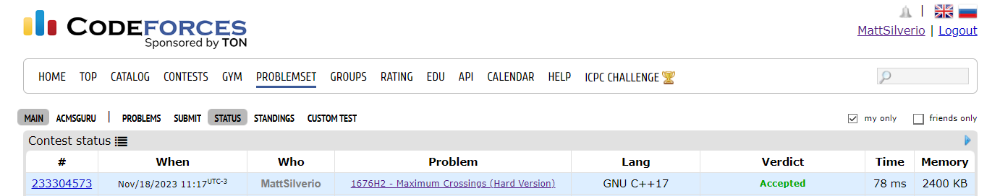
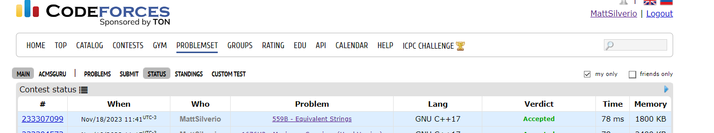

# Exercícios Resolvidos

**Conteúdo da Disciplina**: Dividir e Conquistar 

## Alunos
|Matrícula | Aluno |
| -- | -- |
| 15/0154348  | Matheus Phillipo Silverio Silva |
| 19/0134810  |  Shaíne Aparecida Cardoso de Oliveira |

## Sobre 
O repositório contém soluções para algumas questões de juíz online do LeetCode e CodeForces:

- [Submatriz Máxima](https://leetcode.com/problems/maximum-subarray/description/)

- [Maximum Crossings (Hard Version)](https://codeforces.com/problemset/problem/1676/H2)

- [Equivalent Strings](https://codeforces.com/problemset/problem/559/B)

## Screenshots e Apresentações
- Submatriz Máxima 

- Maximun Crossings (Hard Version) 

- Equivalent Strings 

## Link das apresentações

Para maior conforto, as apresentações estão no youtube. Mas caso não consiga acessa-las, os vídeos se encontram na pasta [apresentacoes](https://github.com/projeto-de-algoritmos/DividirConquistar_ExerciciosOnline/tree/master/apresentacoes)

- [Apresentação Maximun Crossings e Equivalent Strings](https://www.youtube.com/watch?v=x5gOMcZs21I)

## Saiba Mais
- Árvore de Fenwick

https://www.youtube.com/watch?v=d5PBN2hf2Xo

https://dev.to/wengao/fenwick-tree-vs-segment-tree-1edk

## Instalação 
**Linguagem**: C++ 

## Uso 
Para rodar os algoritmos deste repositório, siga as etapas abaixo:

- Certifique-se de ter um compilador para C++ instalado em sua máquina, recomendamos o g++.
- Faça o clone do repositório Git para o seu ambiente local.
- Compile o arquivo desejado com `g++ -o <nome-do_executavel> <nome-do-arquivo.cpp>`
- Execute o arquivo com `./<nome-do-executavel>`. Certifique-se de que esteja no diretório correto em seu terminal para executar os comandos acima.
- Opcional: Deixamos os arquivos de entrada dos casos de testes de exemplo dos problemas em cada problema, afim de reduzir o tempo de digitação. Ao executar o programa, execute `./<nome-do-executavel> < <nome-do-arquivo-de-input>.txt` 

